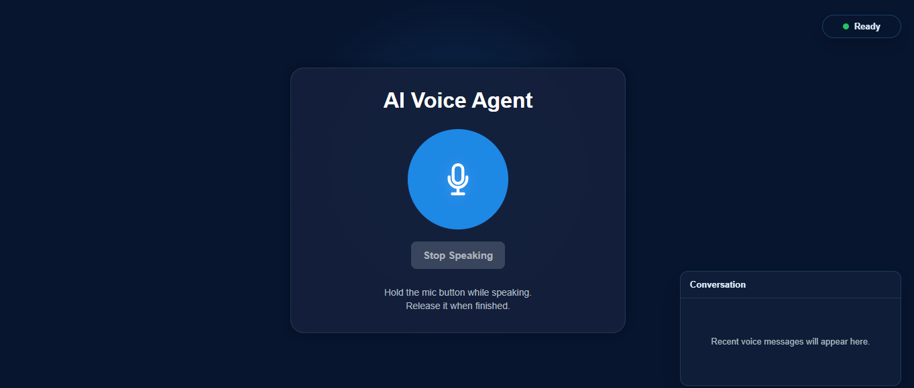
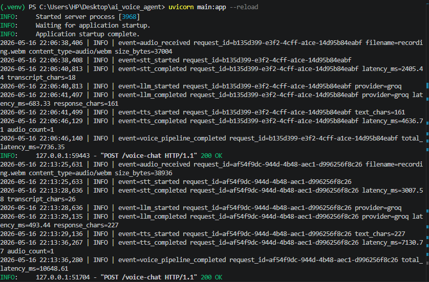

# AI Voice Agent

A browser-based conversational voice assistant built with FastAPI, Groq, and Sarvam AI speech APIs.

The project captures microphone input in the browser, sends the recorded audio to a FastAPI backend, transcribes speech with Sarvam, generates a short conversational response using Groq, converts the response back to speech with Sarvam, and plays the generated audio in the browser.

This is an evolving AI assistant system focused on practical voice interaction, modular backend services, and a clean frontend-to-backend voice pipeline.

## Problem Statement

Most assistant demos start with typed chat, but many real assistant workflows are voice-first. The engineering challenge is coordinating browser recording, speech-to-text, LLM response generation, text-to-speech, audio playback, interruption handling, and observability in one stable request-response pipeline.

This project focuses on that orchestration layer: making the system usable from the browser while keeping the backend modular enough to improve providers, latency, and interaction behavior over time.

## Why I Built This

I built this project to explore how a practical Voice AI assistant can be assembled from production-style components without overcomplicating the architecture. The goal was to demonstrate a working conversational loop, clear service boundaries, observable pipeline stages, and a minimal voice-first frontend suitable for iteration.

## Features

- Browser microphone input using the MediaRecorder API
- Speech-to-text transcription through Sarvam AI
- Groq-powered conversational responses
- Short-term conversational memory per session
- Text-to-speech voice replies through Sarvam AI
- Browser audio playback for generated responses
- Stop Speaking control for interrupting current playback
- Lightweight AI status indicator for listening, thinking, and speaking states
- Compact conversation history panel for demo visibility
- Structured pipeline logging with latency metrics
- FastAPI backend with modular route and service layers
- Simple HTML, CSS, and JavaScript frontend

## Demo Section

### Frontend UI



### Pipeline Logs



### Loom Demo

https://www.loom.com/share/aa14ca5466e84cf7a381dd44fb9e5695

## Architecture Flow

```text
Browser microphone
    -> frontend/script.js
    -> POST /voice-chat
    -> FastAPI backend
    -> Sarvam Speech-to-Text
    -> Groq LLM
    -> Sarvam Text-to-Speech
    -> WAV audio response
    -> Browser playback
```

## Workflow Comparison

| Area | Traditional Chat Workflow | This Voice-First AI System |
| --- | --- | --- |
| User input | Typed text message | Browser microphone recording |
| Input processing | Direct text payload | Audio upload followed by speech-to-text |
| Model interaction | LLM receives text | LLM receives transcribed speech |
| Output | Text response in chat UI | Generated speech audio played in browser |
| Interaction style | Keyboard-first | Voice-first with optional conversation visibility |
| Interruption | Usually not needed | Stop Speaking control resets active playback |
| Observability | Often request-level logs only | Stage-level logs for STT, LLM, TTS, and total latency |

## Observability & Metrics

The backend logs structured pipeline events through the project logger. Each `/voice-chat` request receives a `request_id`, making it easier to follow the orchestration flow across STT, Groq, TTS, and final response generation.

Example observed timings from `logs/app.log`:

| Metric | Observed latency |
| --- | ---: |
| STT latency | 2518.09 ms |
| LLM latency | 350.86 ms |
| TTS latency | 2351.95 ms |
| Total pipeline latency | 5228.98 ms |

The logs are intended to support demo review, performance evaluation, and future optimization work without requiring a separate observability stack.

## Tech Stack

### Backend

- Python
- FastAPI
- Uvicorn
- HTTPX
- Pydantic
- python-dotenv

### AI Services

- Groq LLM API
- Sarvam AI Speech-to-Text
- Sarvam AI Text-to-Speech

### Frontend

- HTML
- CSS
- JavaScript
- Browser MediaRecorder API
- Browser Audio API

## Folder Structure

```text
ai_voice_agent/
|-- app/
|   |-- api/
|   |   `-- routes/
|   |       |-- chat_routes.py
|   |       |-- tts_routes.py
|   |       |-- voice_routes.py
|   |       `-- websocket_routes.py
|   |-- core/
|   |   |-- config.py
|   |   `-- logger.py
|   |-- models/
|   |   `-- chat_models.py
|   |-- services/
|   |   |-- cache_service.py
|   |   |-- groq_service.py
|   |   `-- sarvam_service.py
|   `-- utils/
|-- frontend/
|   |-- index.html
|   |-- script.js
|   `-- style.css
|-- generated_audio/
|-- logs/
|-- temp_audio/
|-- main.py
|-- requirements.txt
`-- README.md
```

Note: `chat_routes.py` and `voice_routes.py` are currently mounted in `main.py`. Other route files are present for earlier or future experiments but are not currently mounted.

## Setup Instructions

### 1. Clone the Repository

```bash
git clone https://github.com/mritunjayk-ops/AI_voice_agent.git
cd AI_voice_agent
```

### 2. Create a Virtual Environment

```bash
python -m venv .venv
```

Activate it:

```bash
# Windows PowerShell
.\.venv\Scripts\Activate.ps1
```

```bash
# macOS / Linux
source .venv/bin/activate
```

### 3. Install Dependencies

```bash
pip install -r requirements.txt
```

### 4. Configure Environment Variables

Create a `.env` file in the project root:

```env
GROQ_API_KEY=your_groq_api_key
SARVAM_API_KEY=your_sarvam_api_key
```

## Running the Application

### Run the Backend

From the project root:

```bash
uvicorn main:app --host 127.0.0.1 --port 8000 --reload
```

Backend health check:

```text
http://127.0.0.1:8000/health
```

Interactive API docs:

```text
http://127.0.0.1:8000/docs
```

### Run the Frontend

Serve the `frontend/` directory on port `5500`, because CORS is configured for:

```text
http://localhost:5500
http://127.0.0.1:5500
```

One simple option is to use Python's static file server:

```bash
cd frontend
python -m http.server 5500
```

Then open:

```text
http://127.0.0.1:5500
```

You can also use a local development server such as VS Code Live Server, as long as it serves the frontend from port `5500`.

## Usage

1. Start the FastAPI backend.
2. Start the frontend server.
3. Open the frontend in a browser.
4. Hold the microphone button and speak.
5. Release the button to send the recording to the backend.
6. The backend transcribes the audio, generates a Groq response, converts it to speech, and returns a WAV file.
7. The browser plays the generated voice response.
8. Use Stop Speaking to interrupt current playback and return to a ready state.

## API Endpoints

### `GET /health`

Returns a basic health check response.

### `POST /chat`

Accepts a text message and returns a Groq-generated response with session memory.

### `POST /voice-chat`

Accepts an uploaded audio file from the browser and returns generated speech audio.

Pipeline:

```text
audio file -> Sarvam STT -> Groq -> Sarvam TTS -> audio/wav
```

The response remains playable audio. The backend also exposes transcript and AI response text through response headers so the lightweight conversation panel can render the exchange without changing the core audio contract.

### `GET /voice-test`

Runs a hardcoded voice test prompt through Groq and Sarvam TTS, then returns a generated WAV file.

## AI-Native Development Workflow

The project includes a `.cursorrules` file to guide collaborative AI-assisted development. Its purpose is to keep future changes aligned with the current architecture and product direction:

- preserve route, service, frontend, and logging boundaries
- avoid unnecessary rewrites or speculative abstractions
- keep the frontend voice-first and minimal
- preserve the `/voice-chat` audio contract and interruption behavior
- maintain structured logging and latency metrics
- prevent hardcoded secrets or provider credentials

These rules are intended to make AI-native iteration safer by giving coding assistants explicit project constraints before they modify the codebase.

## Current Limitations

- Voice interaction is request-response based, not realtime streaming.
- Interruption handling is frontend-side: Stop Speaking immediately stops current browser playback, but provider calls already in progress are not cancelled server-side.
- Conversational memory is in-memory only and resets when the backend restarts.
- Generated audio files are stored locally in `generated_audio/`.
- The frontend is intentionally minimal and currently optimized for desktop browser use.
- WebSocket route files exist in the repository, but websocket routes are not mounted in the active FastAPI app.

## Future Roadmap

- Realtime streaming speech-to-text and text-to-speech
- More natural interruption handling while the assistant is speaking
- Long-term memory backed by a persistent database or vector store
- Multi-agent architecture for task planning and tool use
- Stronger frontend states for recording, processing, speaking, and errors
- Authentication and user-specific memory
- Deployment-ready configuration for cloud hosting
- Observability for latency, API failures, and conversation quality

## Author

**Mritunjay Kumar**

AI builder focused on voice agents, applied LLM systems, and practical assistant workflows.
